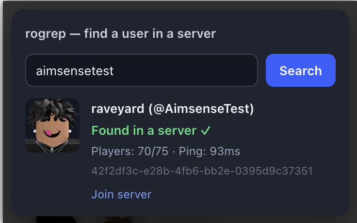

# rogrep

Find a Roblox user in a public game server.

## Install

1. Install [Violentmonkey](https://violentmonkey.github.io/)
2. Click below to install the script

**[→ Install rogrep](https://github.com/iluvx/rogrep/raw/refs/heads/main/dist/rogrep.user.js)**

## Usage

Open any Roblox game page, click the **rogrep** button, enter a username, and search.

## For developers
Start the project with `npm run dev` then run `pnpm dlx http-server -c5` and load the dist file in to violentmonkey.