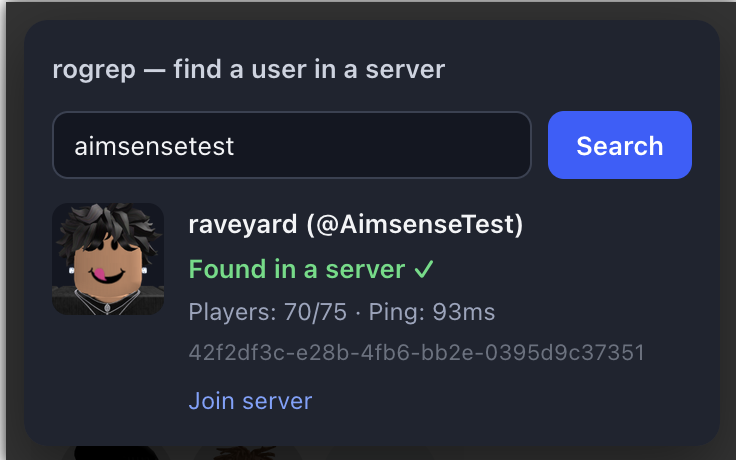

# rogrep

Find a Roblox user in a public game server.



## Install

1. Install [Violentmonkey](https://violentmonkey.github.io/)
2. Click below to install the script

**[→ Install rogrep](https://github.com/iluvx/rogrep/raw/refs/heads/main/dist/rogrep.user.js)**

## Usage

Open any Roblox game page, click the **rogrep** button, enter a username, and search.

## For developers

Needs [Bun](https://bun.com).

```bash
bun install
bun run dev
```

Then serve `dist/` (for example `bunx serve dist`) and load `dist/rogrep.user.js` in Violentmonkey.

```bash
bun run build
```

writes the production userscript to `dist/rogrep.user.js`.
